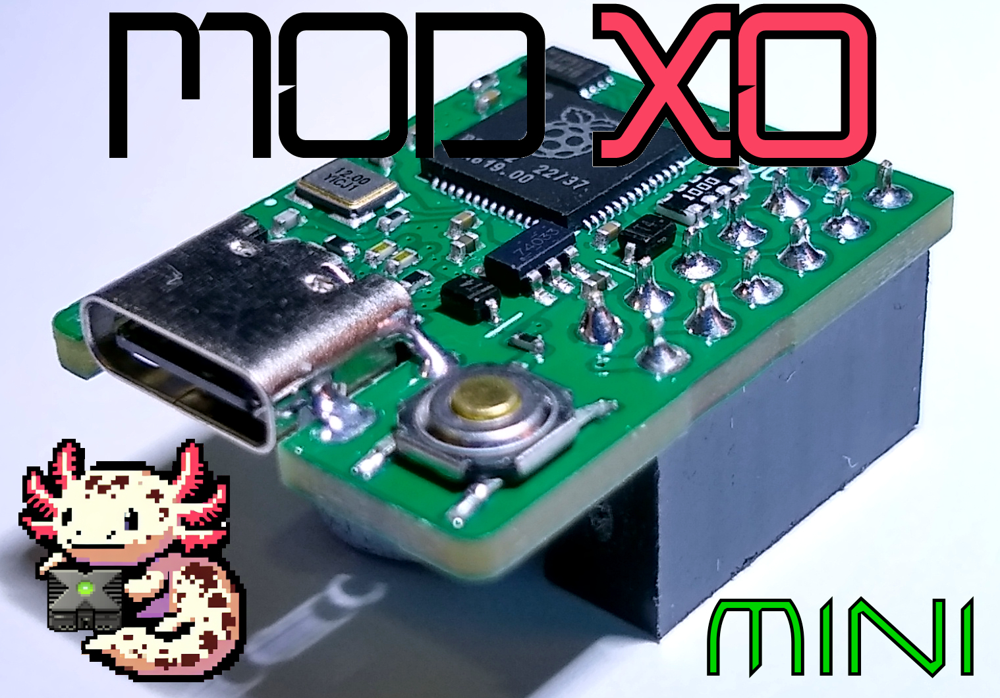

Installation
===
Locating the LPC & D0 Point.pdf
[Locating the LPC & D0 Point.pdf](/Locating the LPC & D0 Point.pdf)

https://www.xbox-scene.info/tutorials/article/43-nemesis-xenium-modchip-installation-guide-for-rev-10-14/

also [Pin Header Install Guide - R1.1.pdf](/Pin Header Install Guide - R1.1.pdf)
please note; the black ground wire is not required, only the D0 wire
(ground is connected on the LPC header).

Usage
===
[Prometheos guide.pdf](/Prometheos guide.pdf)

https://github.com/Team-Resurgent/Modxo

The button is only required when connecting
to a PC to flash a firmware.

Credits
===
Team Resurgent
https://github.com/Team-Resurgent/Modxo