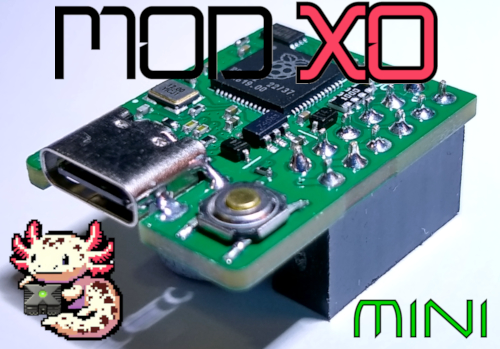

Installation
===
- [Locating_the_LPC_&_D0_Point.pdf](Locating_the_LPC_&_D0_Point.pdf)

- https://www.xbox-scene.info/tutorials/article/43-nemesis-xenium-modchip-installation-guide-for-rev-10-14/

- also [Pin_header_install_guide.pdf](Pin_header_install_guide.pdf)
> [!NOTE]
> the black ground wire is not required, only the D0 wire
(ground is connected on the LPC header).

Usage
===
- [Prometheos_guide.pdf](Prometheos_guide.pdf)

- https://github.com/Team-Resurgent/Modxo

> [!NOTE]
> The button is only required when connecting to a PC to flash a firmware.

Credits
===
- Team Resurgent  
https://github.com/Team-Resurgent/Modxo
